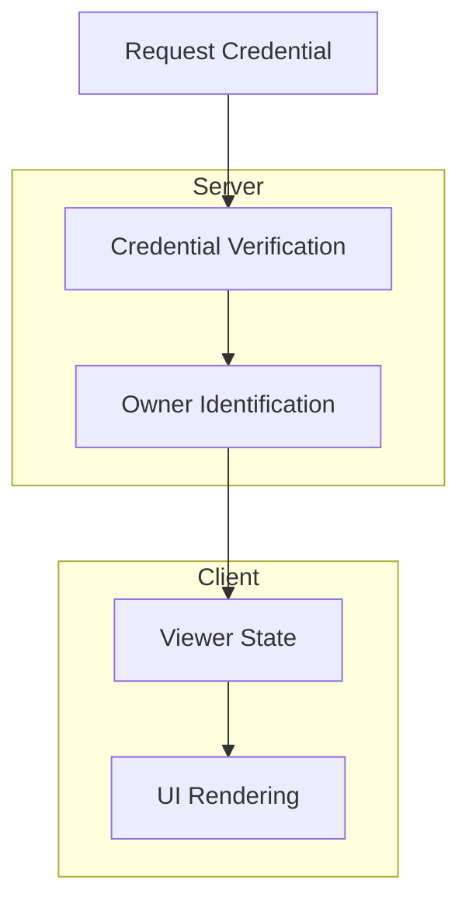
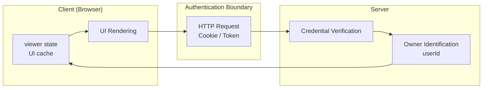
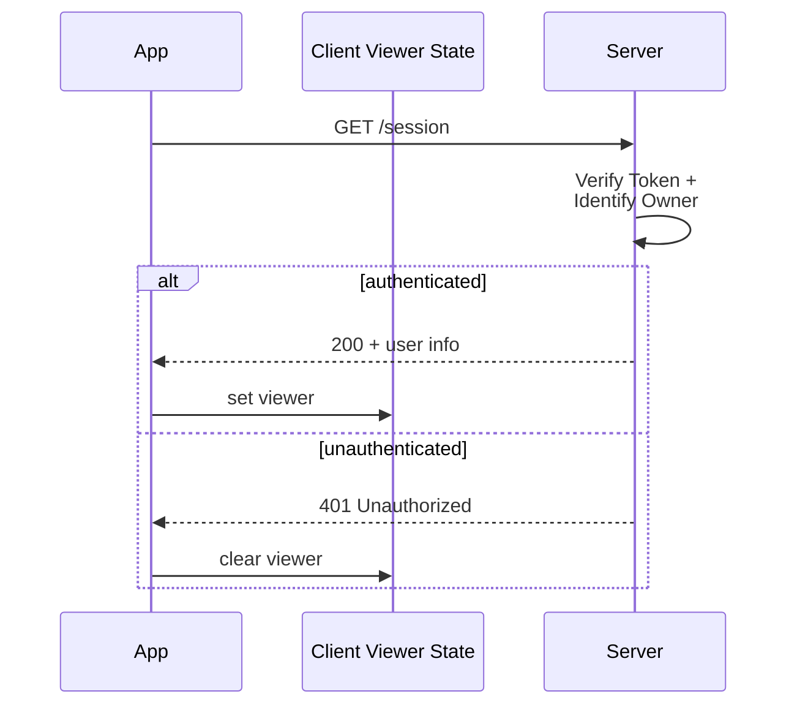

# SPA Authentication Architecture

## Summary

Game Guide Platform의 인증 모델은 다음 원칙을 따른다.

- 인증 근거(authentication proof)는 **요청 credential**이다.
- 인증 판정(authentication decision)은 **서버가 수행한다**.
- `userId`는 인증 근거가 아니라 **인증 결과로 파생되는 식별자**이다.
- 클라이언트는 `viewer`를 통해 **UI 상태만 표현한다**.

즉, **authentication decision belongs to the server**이며, 클라이언트 상태는 인증의 진실원이 아니다.

---

이 문서는 **Game Guide Platform**을 개발하면서 정리한 인증 모델을 설명한다. 실제 개발 과정에서 발생한 문제와 질문을 통해 최종적으로 **어떤 인증 모델**을 갖게 되었는지 정리하는 것을 목표로 한다.

문서는 다음 흐름으로 구성된다.

```
Problem → Flow → Model
```

즉, 실제 프로젝트에서 발생한 문제를 먼저 설명하고, 그 문제를 해결하는 과정에서 도출된 인증 흐름과 최종 인증 모델을 정리한다.

---

## Evolution of the Authentication Design

인증 구조는 다음 세 단계를 거쳐 변화했다.

### v1 — Session State in Store

store가 `session(nickname)`을 보관하고 이를 인증 근거처럼 사용하는 구조였다.

```
store.session.nickname
```

이 방식은 구현이 단순하지만 다음 문제가 있다.

- 표시값과 식별자가 결합됨
- 클라이언트 상태를 인증 근거처럼 사용하게 됨

---

### v2 — Access Token in Client State

store에 `accessToken`을 저장하고, 서비스 레이어에서 토큰 존재 여부를 기반으로 인증을 사전 검증하는 구조였다.

```
if (!accessToken) throw AuthRequiredError
```

그러나 이 방식은 여전히 **client state 기반 인증**이라는 문제가 있었다.

---

### v3 — Server‑Verified Authentication (Final)

최종 구조에서는 인증 책임을 다음과 같이 분리했다.

- `accessToken` → localStorage
- `refreshToken` → cookie
- `viewer` → UI 상태만 보관

즉 **인증 판정은 서버가 수행하고, 클라이언트는 UI 상태만 관리한다.**

---

# 1. Problem

## 1.1 표시값과 식별자 (nickname vs userId)

v1에서는 nickname을 사용자 식별값처럼 사용하고 있었다.

예:

```
viewer = {
  nickname: "재훈"
}
```

이 방식은 현재 요구사항에서는 동작할 수 있지만 구조적으로 다음 문제가 있다.

- nickname은 **표시값(display value)** 이다
- nickname은 **변경될 수 있다**
- nickname은 **충돌 가능성**이 있다

따라서 nickname을 식별자로 사용하면 **표시값과 식별값이 결합된 구조**가 된다.

식별자는 다음 특성을 가져야 한다.

- 변경되지 않아야 한다
- 시스템 내부에서 안정적으로 식별 가능해야 한다

따라서 인증 결과로 사용되는 식별자는 nickname이 아니라 **userId**여야 한다.

```
userId → 식별자
nickname → 표시값
```

---

## 1.2 viewer state는 신뢰할 수 있는가

프론트에서는 로그인 이후 다음과 같은 상태를 유지한다.

```
viewer = {
  nickname: "재훈"
}
```

하지만 `viewer`는 **클라이언트 상태**이기 때문에 다음 문제가 있다.

- 개발자 도구로 수정 가능
- 로컬 상태와 서버 상태가 불일치할 수 있음
- 페이지 새로고침 시 초기화됨

즉 `viewer`는 **authentication proof가 아니다.**

`viewer`는 서버 인증 결과를 기반으로 생성되는 **UI 상태 캐시(UI cache)** 이다.

자세한 실패 시나리오는 문서 하단의 **Failure Scenarios** 섹션에서 설명한다.

---

## 1.3 프론트에서 인증을 선검사하는 문제

v1, v2에서는 서비스 레이어에서 세션 존재 여부를 검사하는 코드가 있었다.

예:

```
if (!viewer) {
  throw new AuthRequiredError()
}

await apiClient.post("/api/guides", payload)
```

이 방식은 다음 문제를 만든다.

가능한 상황:

- viewer는 없지만 **쿠키는 살아 있음**
- viewer는 있지만 **쿠키는 이미 만료됨**

즉 클라이언트 상태를 기준으로 인증을 판정하면 **잘못된 판단**이 발생할 수 있다.

이 문제 역시 **Failure Scenarios** 섹션에서 자세히 설명한다.

---

# 2. Flow

## 2.1 Session Bootstrap

앱이 처음 실행될 때 클라이언트는 인증 상태를 알 수 없다.

왜냐하면 인증 근거는 클라이언트 상태가 아니라 **요청 credential**이기 때문이다.

따라서 앱 시작 시 다음 과정을 수행한다.

```
bootstrapSession
    ↓
GET /session
    ↓
viewer state 복구
```

이 과정의 목적은 서버 인증 상태를 기준으로
클라이언트 UI 상태를 재검증하고 초기화하는 것이다.

즉 `viewer`는 서버 응답을 기준으로 **초기화된다.**

다만 `viewer`는 서버 인증 상태의 실시간 미러가 아니라  
특정 시점의 인증 결과를 반영한 **UI 캐시**이기 때문에  
앱 실행 중에는 **stale viewer state (outdated UI state)** 가 발생할 수 있다.

이때 중요한 점은 미확인 상태와 실제 인증 실패 상태를 구분하는 것이다.
즉 **“미확인 상태”를 곧바로 “세션 무효”**로 판단해서는 안 된다.

### Session API와 Token Reissue API의 역할 차이

```
/session
→ 현재 사용자(UI 상태) 복구

/reissue
→ 인증 수단(authentication proof) 복구
```

- /session은 “누가 로그인했는가”를 복구하는 API
- /reissue는 “어떻게 인증할 것인가”를 복구하는 API

---

## 2.2 Request Authentication

사용자가 API 요청을 보내면 다음 과정이 수행된다.

```
client request
    ↓
Token 전달
    ↓
server verification
    ↓
owner 식별
```

이 프로젝트에서 사용되는 credential은 다음과 같다.

- `accessToken` (Authorization header)
- `refreshToken` (cookie)

서버는 요청에 포함된 credential을 검증하여 사용자 identity를 결정한다.

중요한 점은 **viewer state는 인증 근거가 아니라는 것**이다.

## 2.3 Authentication State Read vs Write

인증 흐름에서는 **상태 확인(read)** 과 **상태 전이(write)** 를 구분하는 것이 중요하다.

- Bootstrap / loader / `/session` 요청  
  → 현재 인증 상태를 확인하는 **read 단계**

- login / logout / token reissue / 401 처리  
  → 인증 상태를 변경하는 **write 단계**

Bootstrap 단계의 목적은 상태를 변경하는 것이 아니라
현재 인증 상태를 **확인하고 UI 상태를 동기화하는 것**이다.

---

# 3. Model

## 3.1 Authentication Proof

Authentication Proof는 서버가 요청을 **인증된 사용자로 판단하기 위한 근거**이다.

예:

- access token
- refresh token

Authentication Proof의 중요한 특징은 다음과 같다.

```
요청에 포함된다
서버가 검증한다
클라이언트 상태가 아니다
```

---

## 3.2 Owner

Authentication Proof 검증이 완료되면 서버는 요청의 owner를 식별한다.

```
credential 검증
    ↓
userId 추출
    ↓
owner 결정
```

여기서 중요한 점은 다음이다.

```
userId는 인증 근거가 아니다
userId는 인증 결과이다
```

즉 `userId`는 토큰 검증 이후 **파생되는 식별자**이다.

---

## 3.3 Client Viewer State

클라이언트는 서버 인증 결과를 기반으로 `viewer` 상태를 유지한다.

예:

```
viewer = {
  nickname: "재훈"
}
```

`viewer`는 다음 목적을 위해 존재한다.

- UI 상태 표현
- 사용자 정보 표시

그러나 `viewer`는 다음 역할을 하지 않는다.

```
authentication proof
authorization decision
```

`viewer`는 **서버 인증 결과를 반영하는 UI 상태 캐시**일 뿐이다.

---

# 4. Final Authentication Model

Game Guide Platform의 인증 모델은 다음 구조로 동작한다.

```
credential (token / cookie)
        ↓
server verification
        ↓
owner identification (userId)
        ↓
client viewer state (UI cache)
```

이 구조에서 중요한 원칙은 다음과 같다.

1. 인증 근거는 클라이언트 상태가 아니라 요청 credential이다.
2. userId는 인증 근거가 아니라 인증 결과로 파생되는 식별자이다.
3. viewer는 인증 상태가 아니라 UI 상태 캐시이다.
4. 인증 여부는 프론트가 선판정하지 않고 서버 응답으로 판단한다.

이 모델을 통해 인증 책임은 다음과 같이 분리된다.

```
Server
→ credential 검증
→ owner 식별

Client
→ UI 상태 표현
→ 서버 응답 해석
```

---

# 5. Failure Scenarios

이 섹션은 클라이언트 상태를 인증 근거로 사용할 경우 발생할 수 있는 실패 상황을 설명한다.

이러한 문제를 방지하기 위해 현재 인증 모델에서는 **인증 판정을 서버에 위임하는 구조**를 사용한다.

---

## 5.1 Client State Spoofing

클라이언트 상태는 사용자가 임의로 수정할 수 있다.

예를 들어 다음 상태가 있다고 가정하자.

```
viewer = {
  nickname: "재훈"
}
```

하지만 브라우저 개발자 도구를 통해 다음과 같이 쉽게 수정할 수 있다.

```
viewer = {
  nickname: "admin"
}
```

만약 애플리케이션이 `viewer`를 인증 근거처럼 사용한다면, 사용자는 단순히 클라이언트 상태를 수정하는 것만으로 인증된 사용자처럼 행동할 수 있다.

따라서 **클라이언트 상태는 인증 근거로 사용할 수 없다.**

---

## 5.2 Client Pre‑check Mismatch

클라이언트에서 인증을 사전 검사하면 서버 상태와 불일치가 발생할 수 있다.

예:

```
viewer 없음
쿠키 존재
```

이 경우 실제로는 인증된 사용자지만 클라이언트는 인증되지 않은 것으로 판단한다.

반대로 다음 상황도 가능하다.

```
viewer 존재
쿠키 만료
```

이 경우 클라이언트는 인증된 것으로 판단하지만 서버는 인증되지 않은 요청으로 처리한다.

즉 **클라이언트 상태 기반 인증 판정은 항상 불일치 가능성이 존재한다.**

---

## 5.3 Stale Authentication State

클라이언트 상태는 서버 상태보다 쉽게 stale 상태가 된다.

예를 들어 다음 상황을 생각해볼 수 있다.

```
로그인
→ viewer 설정
→ refresh token 만료
→ viewer는 그대로 유지
```

이 경우 UI는 여전히 로그인 상태처럼 보이지만 실제 인증은 이미 만료된 상태이다.

이 문제를 해결하기 위해 애플리케이션은 다음 구조를 사용한다.

```
앱 시작
→ GET /session
→ 서버 인증 검증
→ viewer 재설정
```

즉 `viewer` 상태는 앱 초기화 시점에 **서버 인증 결과를 기준으로 재설정된다.**

## 5.4 Session Reset Principle

세션 상태 reset은 인증이 **확실히 무효화된 경우에만 수행한다.**

예:

- 사용자 로그아웃
- 서버 401 응답
- refresh token 재발급 실패

반대로 다음 상황에서는 세션을 즉시 reset하지 않는다.

- 네트워크 오류
- 서버 5xx
- 인증 상태가 아직 확인되지 않은 초기 단계

즉 **미확인 상태를 인증 실패로 단정하지 않는 것이 중요하다.**

---







## 용어 정리

```
viewer
→ UI 상태 캐시

authentication proof
→ 인증 검증에 사용되는 요청 credential

owner
→ 서버 검증을 통해 식별된 인증된 사용자
```

## Related Concepts

이 문서에서 사용하는 인증 개념은 다음 문서를 참고할 수 있다.

- [Authentication Model Structure](authentication-model-structure.md)
