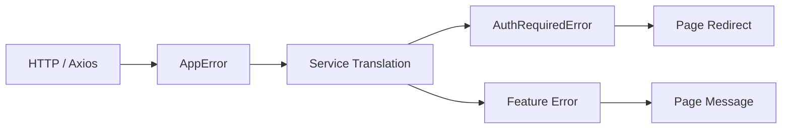

# Dev Issue: Error Layer Design

## 배경

프로젝트 초기에는 API 요청 실패를 **페이지에서 직접 처리**하고 있었다.

예:

```ts
if (err instanceof AppError && err.code === "UNAUTHORIZED") {
  navigate("/login");
}
```

또는

```ts
if (axios.isAxiosError(err) && err.response?.status === 404) {
  setError("NOT_FOUND");
}
```

이 방식은 다음 문제를 만들었다.

- 페이지가 **HTTP 상태 코드에 의존**
- 인증 실패 처리 로직이 **여러 페이지에 반복**
- axios / HTTP 세부 구현이 **UI 계층으로 누출**

즉 **에러 의미 해석 계층이 명확하지 않았다.**

---

# 문제

에러가 다음 세 계층의 의미가 섞여 있었다.

```
HTTP / 네트워크 에러
앱 공통 의미 에러
기능 도메인 에러
```

예:

```
401
NETWORK
SERVER
NOT_FOUND
NICKNAME_DUPLICATE
```

이 상태에서는

- 어디서 에러 의미를 해석해야 하는지 불명확
- 페이지 코드가 점점 복잡해짐
- 인터셉터 정책 변경 시 UI 코드 수정 필요

---

# 해결 접근

에러 의미를 **계층별로 분리**했다.

```
HTTP / Axios / Interceptor
↓
AppError (인프라 의미)
↓
Service layer translation
↓
AuthRequiredError | FeatureError (앱 의미)
↓
Page
```

즉

```
apiClient
→ 기술적 실패만 표현

service
→ 앱 의미로 번역

page
→ 앱 의미 에러만 처리
```

---

# 에러 계층 구조

## 1. AppError (인프라 계층)

HTTP / 네트워크 실패를 표현한다.

예:

```
UNAUTHORIZED
NETWORK
SERVER
UNKNOWN
```

특징:

- axios interceptor에서 생성
- 아직 UI 의미가 없다
- 인증 redirect 같은 정책은 포함하지 않는다

즉 AppError는 **기술적 실패를 표현하는 인프라 계층 에러**이다.

---

## 2. AuthRequiredError (앱 공통 계층)

### 의미

`AuthRequiredError`는 **요청이 인증을 필요로 하지만 현재 인증 상태가 유효하지 않음을 의미하는 애플리케이션 에러**이다.

이 에러는 클라이언트가 세션을 사전 검증(pre-check)하여 발생하는 것이 아니라
**서버 인증 검증 결과를 해석하는 과정에서 발생한다.**

즉 다음 상황에서 발생할 수 있다.

- 서버가 `401 Unauthorized` 응답을 반환한 경우
- Access Token이 만료되었고 재발급(reissue)에 실패한 경우
- Refresh Token이 만료된 경우
- 서버가 현재 요청을 인증된 사용자로 식별할 수 없는 경우

중요한 점은 다음과 같다.

```
AuthRequiredError ≠ 클라이언트 세션 누락
```

과거 구조에서는 요청 전에 세션 존재 여부를 검사하여
`SessionRequiredError` 같은 에러를 발생시키는 방식이 사용되었다.

그러나 현재 구조에서는 **클라이언트 상태를 인증 근거로 사용하지 않는다.**

인증 판단은 다음 흐름을 따른다.

```
request credential
→ server verification
→ authentication decision
```

따라서 `AuthRequiredError`는 **클라이언트 상태 기반 pre-check 에러가 아니라
서버 인증 결과를 애플리케이션 의미로 번역한 에러**이다.

페이지에서는 이 에러를 받으면 다음 동작을 수행한다.

```
로그인 페이지 redirect
```

---

## 3. Feature Domain Error (기능 계층)

각 서비스는 기능별 도메인 에러를 가진다.

예:

```
GuideDetailError
DeleteGuideError
CreateGuideError
CreateSessionError
```

이 에러들은 **비즈니스 의미**를 표현한다.

예:

```
NOT_FOUND
FORBIDDEN
NICKNAME_DUPLICATE
```

즉

```
기능 동작 실패의 의미
```

를 표현하는 계층이다.

---

# 최종 처리 구조

페이지는 다음 세 종류만 처리한다.

```
AuthRequiredError
FeatureError
UNKNOWN
```

즉 페이지는 다음을 알 필요가 없다.

```
axios error
HTTP status
AppError
```

이 구조를 통해

- UI 계층에서 HTTP 구현을 분리
- 인증 redirect 로직 중앙화
- 에러 의미 계층을 명확히 분리

할 수 있다.

---

# 현재 프로젝트 규칙

현재 프로젝트는 다음 규칙을 따른다.

```
apiClient
→ AppError 생성

service
→ AppError → AuthRequiredError 또는 DomainError로 번역

page
→ AuthRequiredError / DomainError 처리
```

---

# 결과

이 구조를 통해 다음 효과를 얻었다.

- 페이지 코드 단순화
- 인증 처리 로직 일관성 확보
- 인터셉터 정책 변경 시 UI 수정 최소화
- 에러 의미 계층 분리

즉 에러는 다음 세 단계로 해석된다.

```
기술적 실패
→ 앱 의미
→ UI 처리
```

---

# Related Concepts

인증 모델과 관련된 설명은 다음 문서를 참고한다.

```
/docs/architecture/spa-authentication-architecture.md
```

---

# 한 줄 정리

에러는 **HTTP → AppError → DomainError → Page** 순서로 해석된다.


